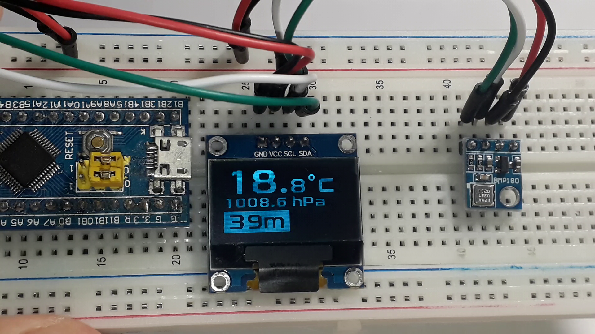

# BMP180 Altimeter with STM32F103C8T6 and SSD1306 Display

## Overview

This project is an **altimeter system** built around the STM32F103C8T6 (Blue Pill) microcontroller. It uses the **BMP180** pressure sensor to measure temperature, atmospheric pressure, and calculates altitude. The readings are displayed in real-time on an **SSD1306** OLED screen via I2C communication.

The firmware is developed in **C** using **Atollic TrueSTUDIO** as the IDE.

## Features

- ✅ Real-time temperature and pressure sensing using BMP180
- ✅ Altitude calculation based on barometric formula
- ✅ I2C communication with both BMP180 and SSD1306 display
- ✅ Clean and organized embedded C code structure
- ✅ Compatible with STM32F103C8T6 (Blue Pill)

## Hardware Requirements

| Component | Description |
|-----------|-------------|
| **MCU** | STM32F103C8T6 (Blue Pill) |
| **Pressure Sensor** | BMP180 (I2C interface) |
| **Display** | SSD1306 OLED (I2C, 128x64) |
| **IDE** | Atollic TrueSTUDIO |
| **Programming Language** | C |

## Pin Connections

| Component | STM32 Pin | Function |
|-----------|-----------|----------|
| BMP180 SDA | PB7 | I2C1_SDA |
| BMP180 SCL | PB6 | I2C1_SCL |
| SSD1306 SDA | PB7 | I2C1_SDA |
| SSD1306 SCL | PB6 | I2C1_SCL |
| VCC (both) | 3.3V | Power Supply |
| GND (both) | GND | Ground |

> **Note:** Both devices share the same I2C bus (PB6 and PB7) since they have different I2C addresses.

## How It Works

1. **Sensor Reading**: The BMP180 sensor provides uncompensated pressure and temperature values
2. **Data Processing**: The microcontroller reads raw data and applies compensation formulas
3. **Altitude Calculation**: Altitude is calculated using the lookup table

## Getting Started

### Prerequisites

- Atollic TrueSTUDIO (or any STM32 compatible IDE)
- ST-Link programmer or USB to UART converter for flashing
- STM32F103C8T6 (Blue Pill) board
- BMP180 sensor module
- SSD1306 OLED display (I2C version)

[Watch the video](https://www.youtube.com/watch?v=wYZSTaH1zao)

